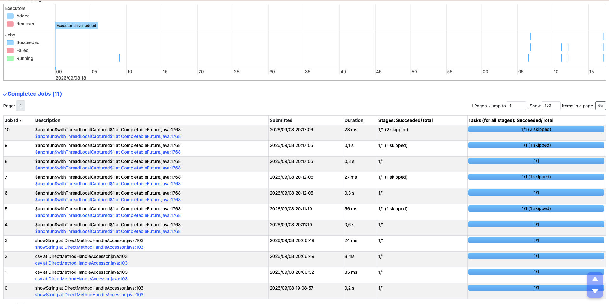

# DataImmo

## Livrable 1 - Ingestion & nettoyage (Python POO + Pandas)

Ce livrable permet de lire un fichier csv et csv compréssé, de nettoyer les enregistrements ainsi que les données mal renseignées. Pour ensuite l'exporter en un fichier .parquet

### Architecture du projet:

- **'script/loader.py'** : Classe qui gère la lecture des fichier CSV et CSV compréssé.
- **'script/cleaner.py'** : Classe permettant de nettoyer les données du fichier csv.
- **'script/exporter.py'** : Classe permettant d'exporter les données du fichier csv en un fichier parquet.
- **'script/main.py'** : Script principal permettant d'exécuter les script précédents.

### Prérequis et installation :

1. Activer votre environnement virtuel :

```bash
python3 -m venv .venv
source .venv/bin/activate
```

2. Installer les bibliothèques suivantes :
   '''bash
   pip install pandas
   '''

### Utilisation :

1. Assurez-vous d'avoir l'arboresence requise :

```bash
.
├── data
│   ├── raw
│   └── clean
```

Ainsi qu'un fichier DVF brut dans le dossier 'data/raw'.
Commande pour télécharger les données du département du Nord (59) :

```bash
curl -L -o data/raw/dvf_59_2024.csv.gz "https://files.data.gouv.fr/geo-dvf/latest/csv/2024/departements/59.csv.gz"
```

2. Exécuter le script :

```bash
python3 script/main.py
```

3. Il ne reste plus qu'à consulter le rapport généré dans la console de votre terminal, ainsi que le fichier parquet dans le dossier 'data/clean'.

## Livrable 2 - Passage à Spark

Bibliothèques à installer :

```bash
pip install pyspark jupyter ipykernel
```

Capture d'écran du résultat de l'agrégation et du plan d'éxecution :


- Le tableau affiche le prix moyen au m2 agrégé par commune et par type de bien
- Le "== Physical Plan ==" est déclenché par l'instruction .explain(). Il permet de visualiser comment Spark exécute le code. On y retrouve :
  - La lecture du fichier (FileScan csv)
  - L'application des filtres pour écarter les données non pertinentes (Filter)
  - La préparation des colonnes (Project)
  - Les opérations d'agrégation et de jointure (HashAggregate)

Capture d'écran de l'interface web Spark :



Cette interface de Spark nous permet de visualiser comment Spark exécute le code. Ce sont comme des logs, de chaque exécution / utilisation de Spark.

## Livrable 3 - Analyse massive & performance

Voir le README suivant : [text](benchmark.md)

Voici la commande a effectuer afin de récupérer les fichier dvf de 2021 à 2024 :

```bash
for annee in 2020 2021 2022 2023 2024; do
   curl -L -o "data/raw/dvf_full_${annee}.csv.gz" "https://files.data.gouv.fr/geo-dvf/latest/csv/${annee}/full.csv.gz"
done
```

Et la commande pour récupérer le fichier communes_france :

```bash
curl -L -o data/raw/communes_france.csv "https://www.data.gouv.fr/fr/datasets/r/dbe8a621-a9c4-4bc3-9cae-be1699c5ff25"
```

## Livrable 4 - Visualisation & API

Ce livrable permet de représenter des données agrégées de 2021 à 2024 à travers plusieurs graphique et une API Flask.

Avant de visualiser les différents graphiques, ainsi que d'utiliser l'API il faut installer les bibliothèques suivantes:

```bash
pip install folium seaborn flask
```

Et Voici le résultat de ce livrable avec des captures d'écrans.

### 1ere partie du livrable - Visualisations des données via des graphiques et une carte de la France

- _Premier graphique :_ Evolution des prix au m2 (via Matplotlib)


- _Deuxieme graphique :_ Volumes de ventes par mois (via Matplotlib)


- _Troisième graphique :_ Distribution Maison VS Appartement (via Seaborn)


- _Carte interactive :_ Carte choroplèthe de la France du prix au m2 par département (via Folium)


### 2e partie du livrable - API Flask

3 requètes ont été implémenté dans l'API Flask:

- 1ere requete : Statistique d'un département


- 2e requete : Evolution nationale par année


- 3e requete : Un top des communes (possiblité de choisir le nombre de communes dans le top)


